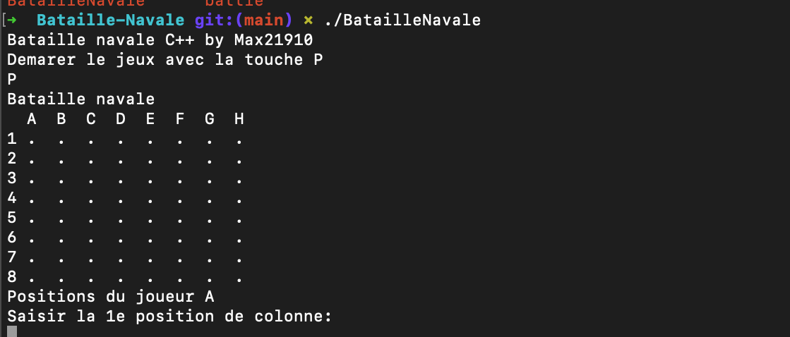
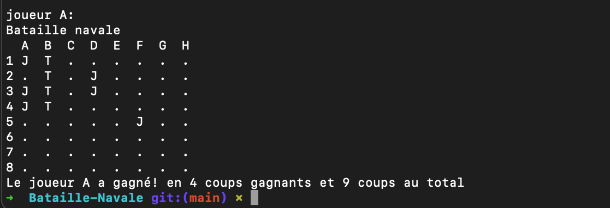

## Bataille Navale Game in C++
This is a console-based Bataille Navale (Battleship) game implemented in C++.
(this is a school project)
Overview
This program simulates a two-player Battleship game where players place their ships on an 8x8 grid and take turns to guess and attack each other's ships.


## Gameplay
-Players input the positions of their ships by specifying the column (A-H) and row (1-8).

-Once ships are placed, players take turns to fire at the opponent's grid by inputting coordinates.

The game ends when one player successfully sinks all of the opponent's ships.

## How to Play
Compile the code using a C++ compiler.
Run the compiled executable.
Follow the instructions to input ship positions and take shots at the opponent's grid.
Code Structure
printNavireA() and printNavireB() print the initial ship placements for Player A and Player B, respectively.
printshootA() and printshootB() display the shots fired by Player A and Player B.
input_playerA() and input_playerB() allow players to input their ship positions.
Place_Fire() controls the turn-based firing mechanism and determines the winner.
createGameTable() initializes the game grids.
Usage
To run the game:

# Compile the code
```
g++ Bataille-Navale.cpp -o BatailleNavale
```
# Run the compiled code
```
./BatailleNavale
```
Follow the on-screen instructions to play the game.


created with ❤️ by max21910 in 🇫🇷